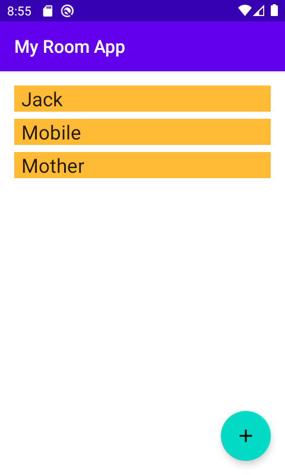
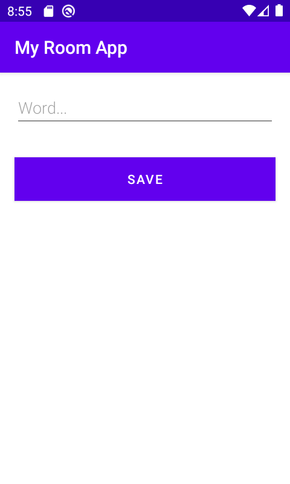

# Room Sample App 

## App Overview
This is a sample app made by following the [Android Room with a View - Java](https://developer.android.com/codelabs/android-room-with-a-view#0) codelab to build a simple app using Room database to manage records

## Prerequisites
You need to be familiar with Java, object-oriented design concepts, and Android Development Fundamentals. In particular:
- RecyclerView and adapters
- SQLite database and the SQLite query language
- Threading and ExecutorService
- It helps to be familiar with software architectural patterns that separate data from the user interface, such as MVP or MVC. This codelab implements the architecture defined in the Guide to App Architecture.

## App Overview
<table>
    <tr>
        <td></td>
        <td></td>
    </tr>
</table>

## What are the recommended Architecture Components?
- **[Entity](https://developer.android.com/reference/androidx/room/Entity)**: Annotated class that describes a database table when working with Room.
- **SQLite database**: On device storage. The Room persistence library creates and maintains this database for you.
- **[DAO](https://developer.android.com/reference/androidx/room/Dao.html)**: Data access object. A mapping of SQL queries to functions. When you use a DAO, you call the methods, and Room takes care of the rest.
- **[Room database](https://developer.android.com/topic/libraries/architecture/room)**: Simplifies database work and serves as an access point to the underlying SQLite database (hides SQLiteOpenHelper). The Room database uses the DAO to issue queries to the SQLite database.
- **Repository**: Used to manage multiple data sources.
- **[ViewModel](https://developer.android.com/topic/libraries/architecture/viewmodel)**: Acts as a communication center between the Repository (data) and the UI. The UI no longer needs to worry about the origin of the data. ViewModel instances survive Activity/Fragment recreation.
- **[LiveData](https://developer.android.com/topic/libraries/architecture/livedata)**: A data holder class that can be observed. Always holds/caches the latest version of data, and notifies its observers when data has changed. LiveData is lifecycle aware. UI components just observe relevant data and don't stop or resume observation. LiveData automatically manages all of this since it's aware of the relevant lifecycle status changes while observing.

## Libraries Used
- **[Room Persistence Library](https://developer.android.com/topic/libraries/architecture/room.html)**, part of Google's new Architecture components.
- **[Lifecycle Library](https://developer.android.com/reference/android/arch/lifecycle/Lifecycle)**, part of Google's new Architecture components.

